This directory contains the ACME pipeline. Depending on the running options this pipeline produces a variety of outputs that can be used to gain insight in the analyzed data from a science perspective and a coding/debugging perspective.

Disclaimer: A lot of the code comments, plots, ... mention mass. These are all really mass to charge ration or m/z
# Data Products Overview

## ASDPs
ACME outputs a series of science data products

### Science Utility Estimation
To estimate the science utility, we extract a series of features from each sample, apply a non-linear transformation and normalize each feature between 0 and 1. 
Finally, the weighted average of the normalized features is the SUE. Each feature, x_i, is transformed using the following equation:

if x_i is less than x_imax: 

y_i = sqrt(x_i/x_imax)

if x_i is greater than x_imax:

y_i = 1

with x_imax being a user defined scalar for each feature and y_i being the normalized feature. 
Taking the square root allows for the individual features to increase more rapidly for lower values and to slowly saturate when they approach the user defined saturation point, x_imax, for this feature. 
The final SUE is calculated as the weighted mean of the normalized features and is a value between 0 and 1.

- 0 = no science utility
- 1 = maximum science utility

The first feature used to calculate the SUE is the number of identified peaks per sample with a m/z that equals that of ‘known’ compounds. 
These compounds are saved in a customizable list that can be updated throughout the mission. 
The second and third feature are the total number of identified peaks and the average z-score (peak height divided by standard deviation of background) of those peaks. 

The SUE is provided as a text file <exp_name>_SUE.csv

### Diversity Descriptor
Similar to the SUE, the diversity descriptor relies on a list of features. However, the final descriptor is not a scalar but a vector. 
Every feature, x_i, is normalized between 0 and 1 by: 

if x_i is less than x_imax: 

y_i = x_i/x_imax

if x_i is greater than x_imax: 

y_i = 1

Afterwards each normalized feature, y_i, is multiplied by a user defined weight between 0 and 1 and added to the diversity descriptor vector.  
The multiplication with the weights, allows to directly calculate the weighted difference between two samples as their Euclidean distance.

The features informing the diversity descriptor are:

- Number of peaks
- Number of known peaks
- Peak z-score
- Peak height
- Peak volume
- Peak width
- Average background height
- Average background 
- Average background diff

The Diversity Descriptor is provided as a csv file <exp_name>_DD.csv

### List of found Peaks
A list of found peaks is output as <exp_name>_peaks.csv. The list contains the following information about each peak:

- Peak Central Time (Min)
- Mass (amu)
- Peak Volume (Counts): Total number of ion counts in window centered on peak - background
- Peak Amplitude (Counts): Peak height (highest ion count - background)
- Peak Amplitude (ZScore): Peak height / Standard deviation of peak background
- Peak Base Width (sec)
- Peak Left Time (Min)
- Peak Right Time (Min)
- background_abs: Median ion count in background of peak
- background_std: Standard deviation of ion count in background of peak
- background_ratio: Relative difference (one devided by the other) in median of background on the left of peak vs the right of peak
- background_diff: Absolute difference in median of background on the left of peak vs the right of peak
- gauss_loss: MSE of gaussian fit to peak vs time and actual peak for center mass

### Mugshots
A ‘mugshot’ is a small snippet of raw data, which allows us to send the original recording about a peak without having to send the entire recording. Each mugshot is 13 m/z-bins by 121 time-bins. That corresponds to approximately 1 amu/z by 36 sec.
To limit the amount of data needed to store and transmit these mugshots while preserving most of their information we normalize each peak by the maximum ion count and convert these ‘mugshots’ to an 8-bit image. Thus, we discretize the ion counts to numbers between 0 and 255. One mugshot has 2 kB and can provide additional supporting information for identified peaks.
The file name indicates the peak central time, mass, and maximum value. 
The mugshots are slightly bigger than the window size used to analyze the peaks!

### Total Ion Count
The total ion count sums up all ions over the full m/z range. This allows to identify times when ions were registered independent of their m/z. 
The total ion count is provided as a csv ending in <exp_name>_tic.csv

## Background Summary
The Background Summary divides up the background noise into regions of similar characteristics, then
summarizes them with by their mean and standard deviation. This can then be reconstructed to give
context to the quality of detected peaks.

The product file itself is a pickle of a dictionary, compressed with BZ2. 
It is provided as <exp_name>_background.bz2, but it is not human-interpretable, and must be reconstructed
using one of the background scripts in `lib/scripts`.

The following figure demonstrates reconstruction of experiment data from the background summary and mugshots.

## Heatmaps
ACME outputs a variety of Heatmaps that show what the algorithm does at every step of the process.
Found peaks are indicated with green dots starting in step 6. 

Raw data

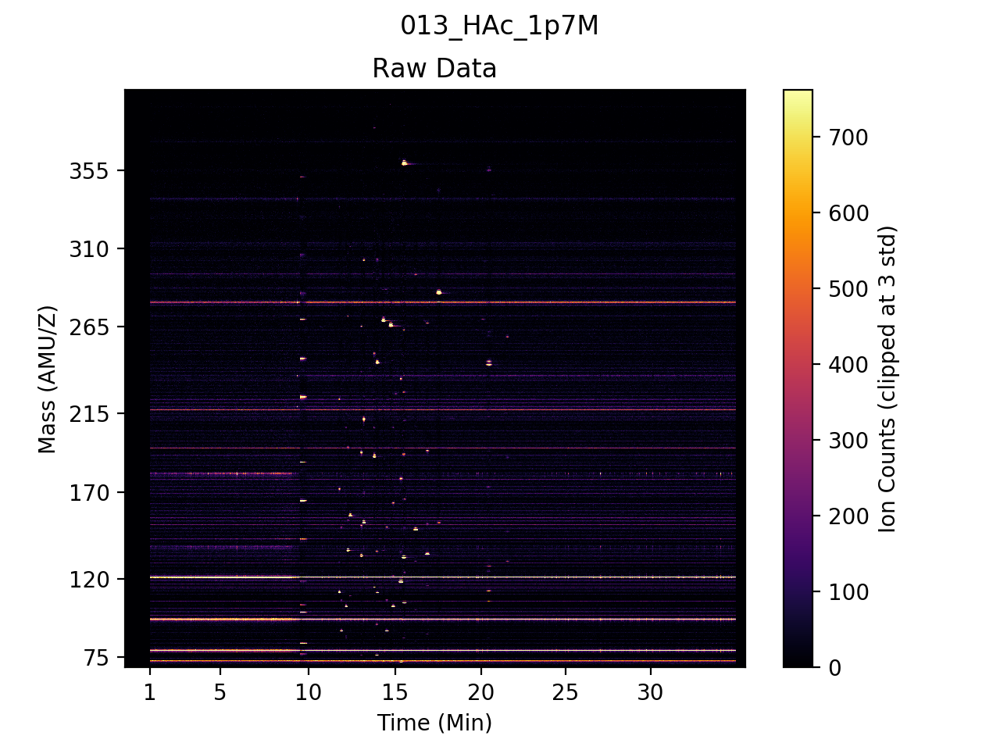

Background extracted with median filter

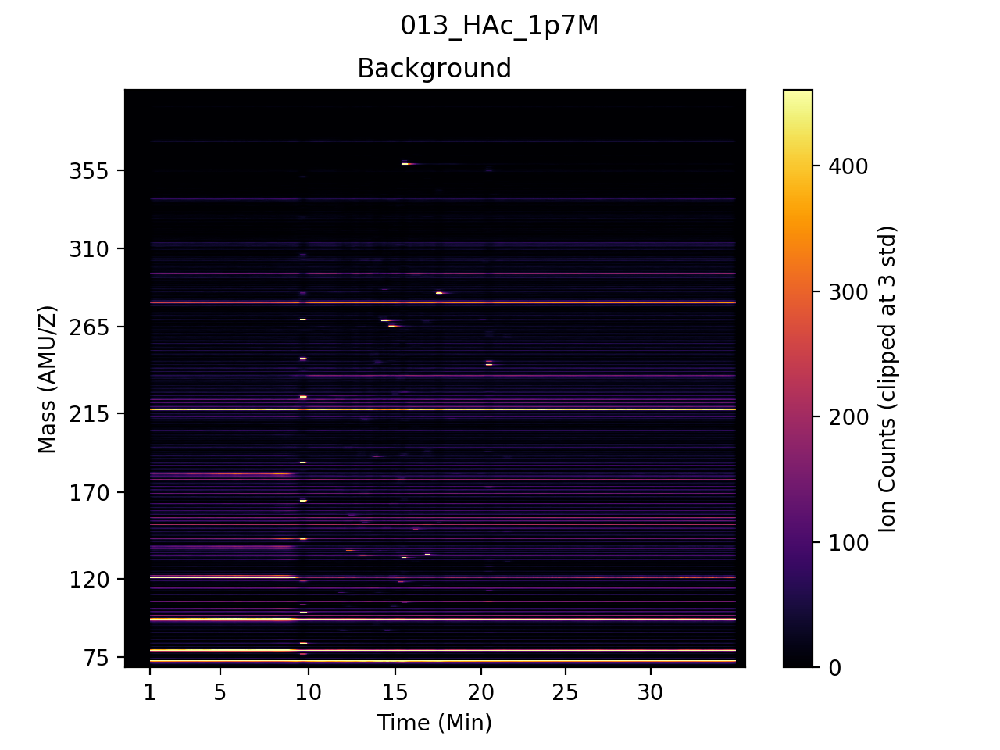

Background removed from Raw data

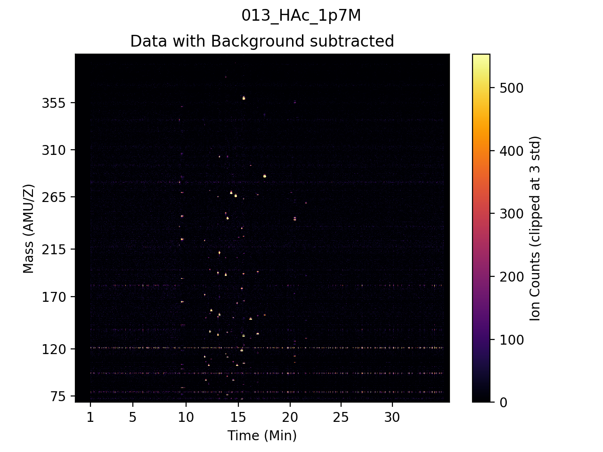

Convolved with difference of Gaussian filter

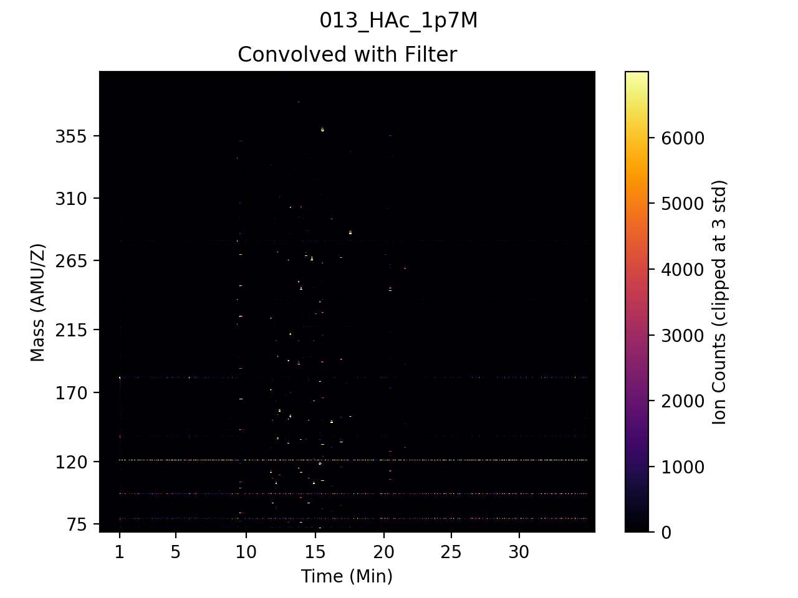

Thresholding/removing small values

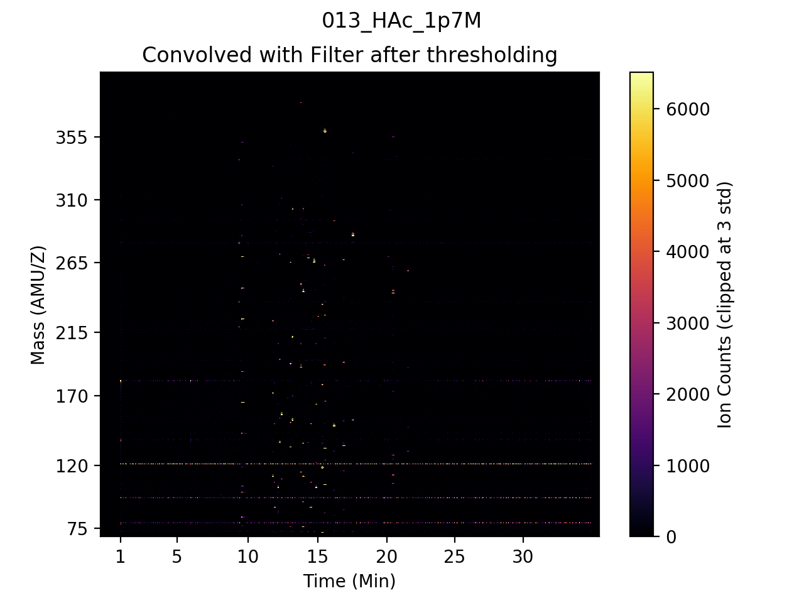

Detect peak candidates with non-max supression

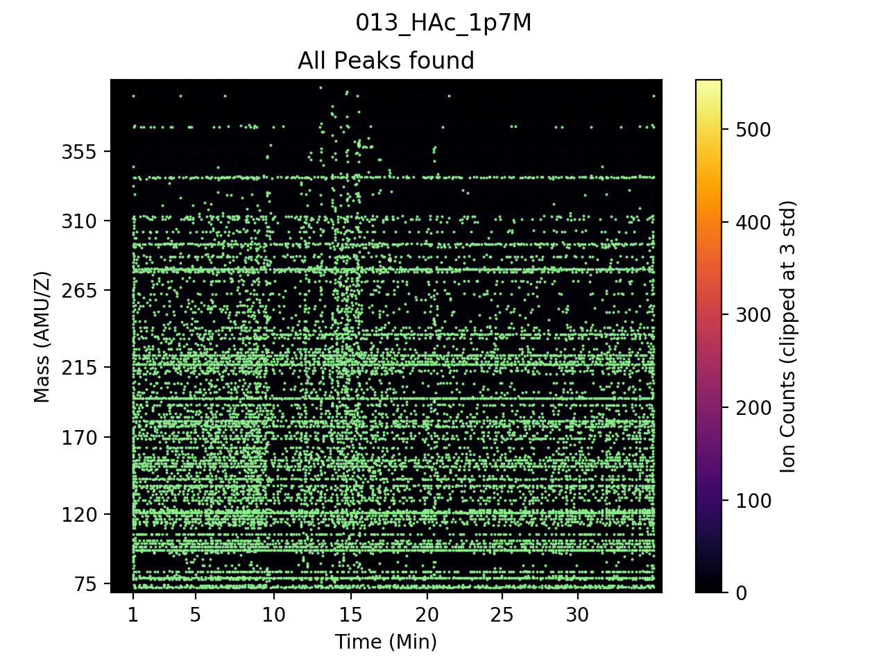

Filter peaks on z-score

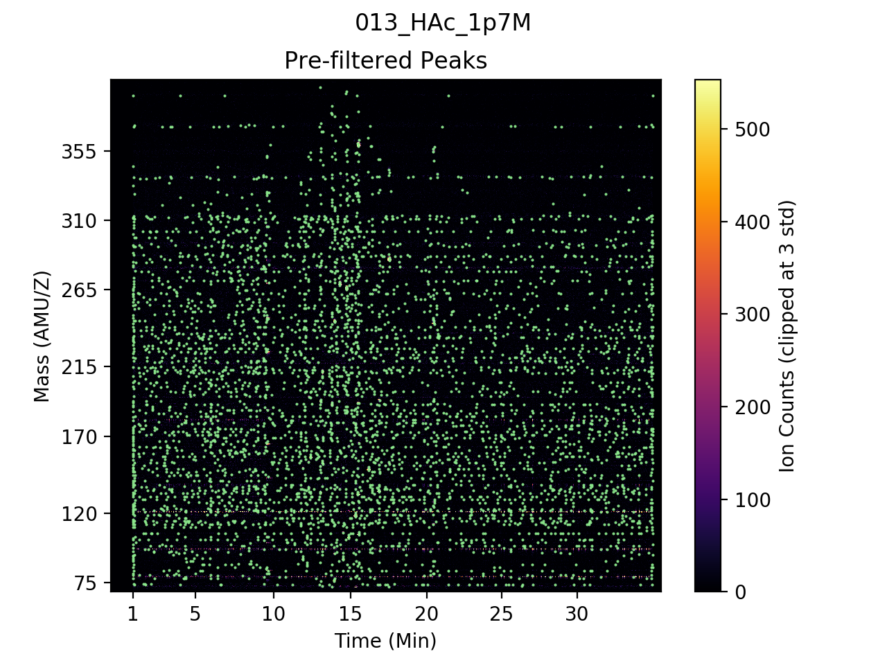

Filter peaks based on whether they appear in known masses. Only true if --known_traces is used.

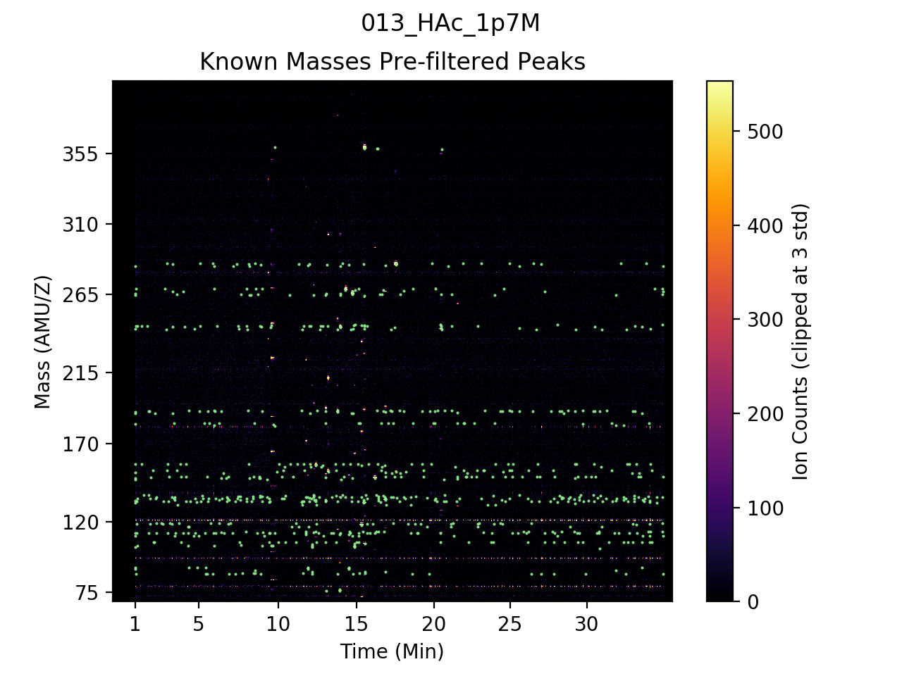

Final list of peaks after filtering with all filters

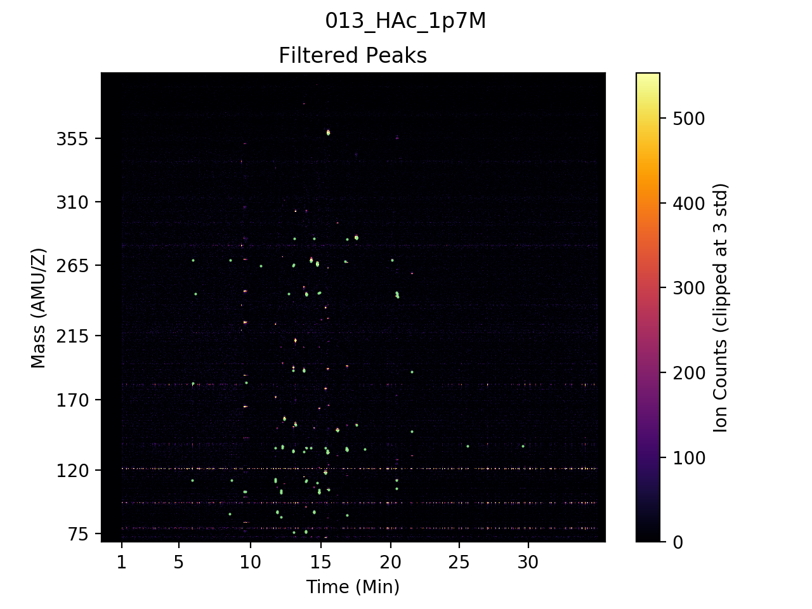

## Mass_Spectra
To get a quick overview of the found peaks we also create Mass Spectra. 
These plots bin +- 10 sec and shows the data with and without background. 
Multiple peaks that are close in time are shown within each plot. The plots as a whole contain all found peaks.
Found peaks are indicated with green stars.

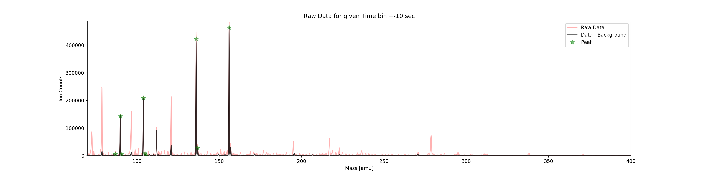

## Time_Trace
The Time Traces are similar to the Mass Spectra but sliced in mass. Plots show binned +- 0.5 amu/z raw data.
Multiple peaks that are close in mass are shown within each plot. The plots as a whole contain all found peaks.
Found peaks are indicated with green stars. Blue dots represent the found start and end time of each peak.

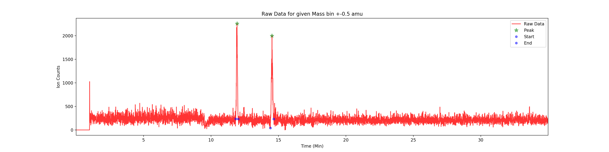

## Debugging 
If the pipeline is run with --debug_plots three additional plots per found peak are generated. Each plot is centered around the found peak and shows the peak vs time, vs mass and a heatmap showing time and mass. 

* The peak vs time plot shows the ion count of the central mass (no binning) as well as the +- 6 neighbouring mass_idx (in a lighter color). 

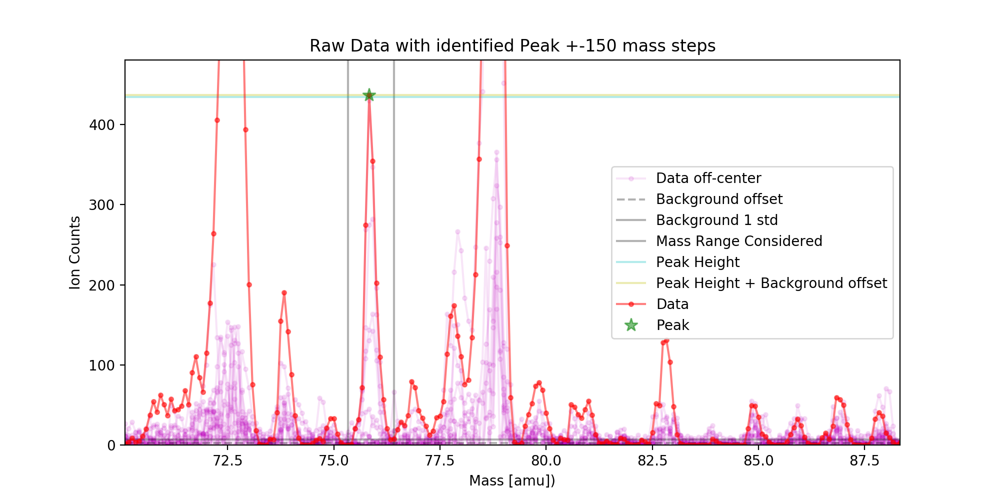

* The peak vs mass plot shows the ion count of the central time as well as +- 5 times evenly spaced in window_x (61 time_idx) (in a lighter color). 

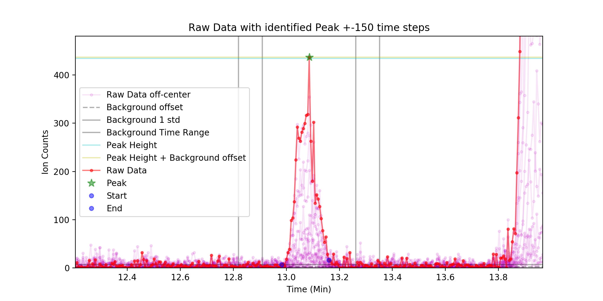

* The peak vs time and mass plot shows the window used to analyze the peak and background.

