# Interpreting Validation

The validate step generates several products that can be used to assess the
quality of collected data. This document describes how each product was
generated and how they can be interpreted.

## Image/Video Products

Sorted by potential usefulness

* `exp_mhi.png` and `exp_mhi_labeled.png`
    * The color of each pixel represents the time at which that location
      experience the maximum difference between two time points. The opacity
      of each pixels represents the difference at that location relative to
      the rest of the image -- relatively large absolute changes will be
      vibrant while small changes will be mostly transparent.
    * From this image, it is possible to interpret where the trails are,
      how quickly the object was moving, and the pattern/behavior of the movement.
    * An experiment with **motile particles** will likely have clear, salient
      tracks in this image.
      Additionally, these tracks should have some velocity, indicated by a less
      color variation, which maps to a smaller time range in the colormap.
        * Example:\
          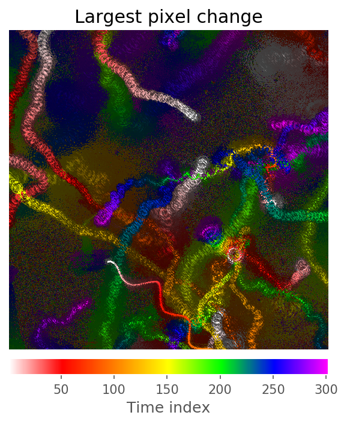
    * An experiment **without motile particles** may have no clear tracks.
      A "smear" pattern could also
      be present, which could be interpreted as the entire sample flowing in
      one direction, or the field of view changing during sampling.
        * Example:\
          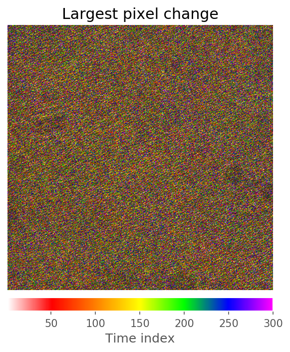
* `exp_k_powerspec_orig.png`
    * Fourier transform for confirming instrument configuration.
    * Example:\
      
* `exp_first_image.png`
    * The first hologram of the sequence. Any obvious issues,
      such as exposure or artifacts, can be quickly diagnosed.
    * Example:\
      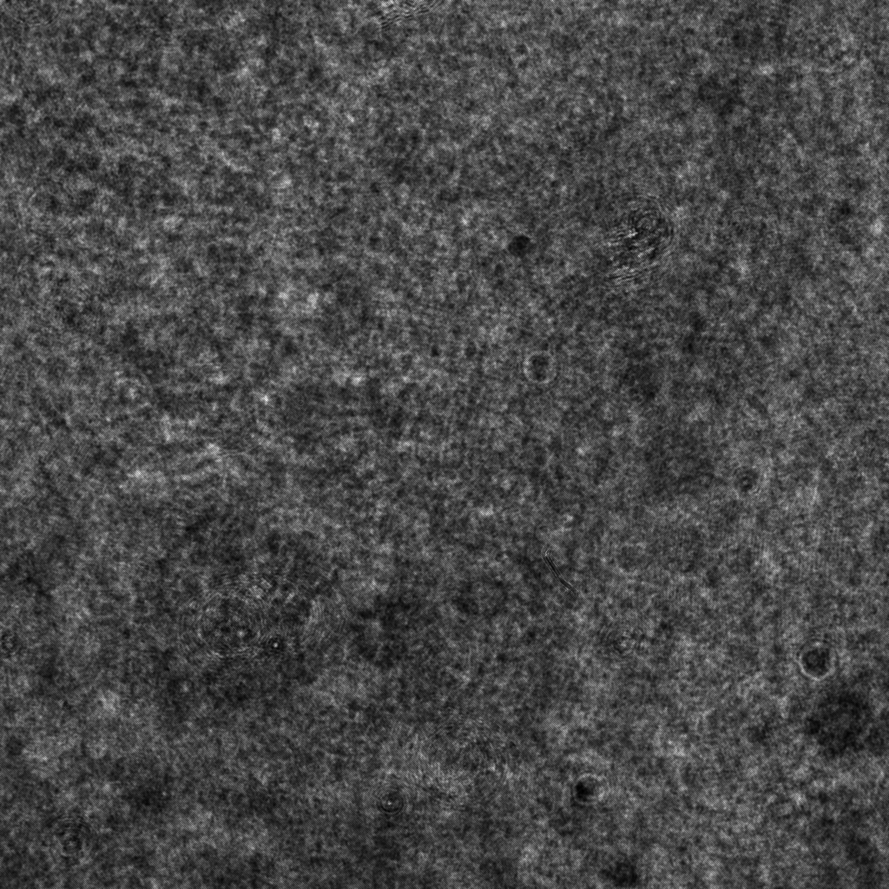
* `exp_median_image.tif`
    * The median image of the hologram of the sequence used to calculate
      baseline subtracted images.
      Useful for visualizing the background noise.
    * Example:\
      
* `exp_first_hist.png`
    * A pixel histogram of the first hologram of the sequence.
      Useful for checking under or over-exposure.
    * Example:\
      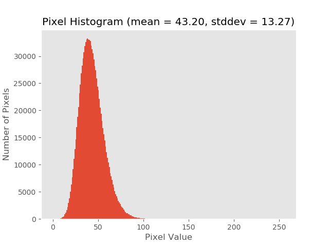
* `exp_density_first_image_stdevs.png`
    * An estimate of an experiment's particle density using standard deviation
      over image blocks. If the standard deviation in a particular block exceeds
      the threshold (set in config), then that block is considered dense.
      Useful for checking how dense/crowded an experiment is.
    * Example:\
      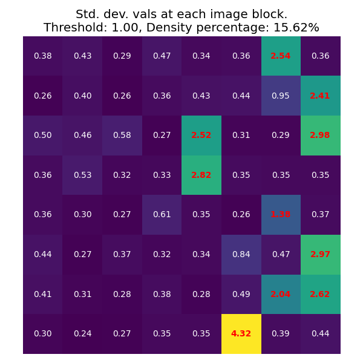
* `exp_density_first_image_viz.gif`
    * An animation showing which blocks of an experiment's first image are
      considered dense.
      Useful for checking how dense/crowded an experiment is and setting an
      appropriate density threshold in the config.
    * Example:\
      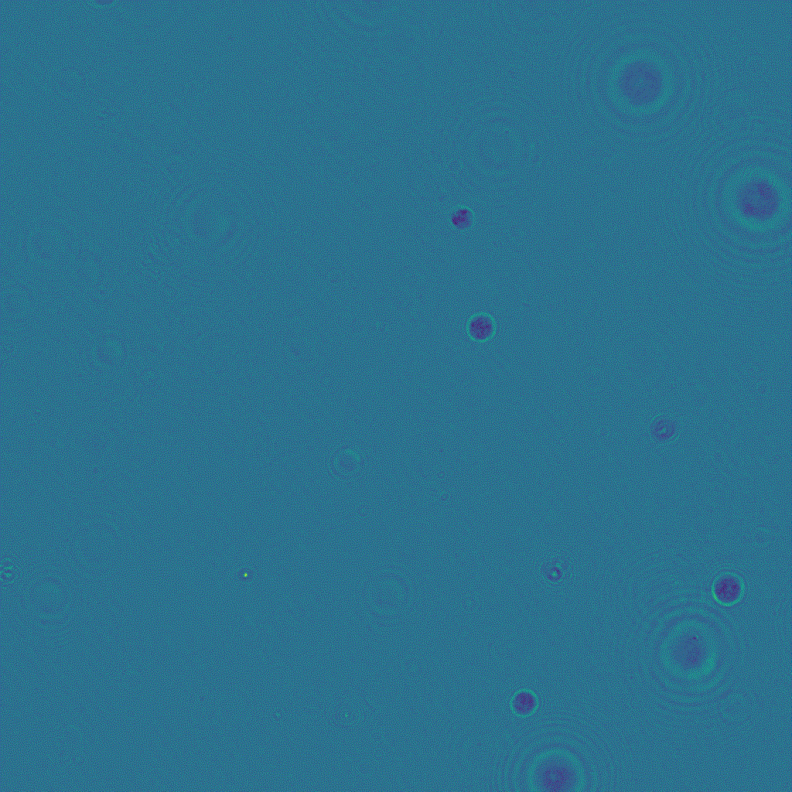
* `exp_base_movie.mp4` and `exp_base_movie.gif`
    * A video of the baseline-subtracted frames
      (currently, the baseline is computed as the median image
      across the dataset). This noise removal makes
      it much easier to identify and track moving targets.
    * Example:\
      
* `exp_diff_movie.mp4` and `exp_diff_movie.gif`
    * A video of the absolute difference between the current frame and the
      previous frame in the sequence. Any objects that have moved between the
      two frames are highlighted with a parentheses-like pattern `()` that
      results from the absolute difference of two offset circles.
    * Example:\
      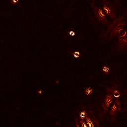
* `exp_trail_movie.mp4` and `exp_trail_movie.gif`
    * A "trail" video of the difference movie above. Each frame contains the
      maximum pixel value from the last 5 difference frames, including the current
      frame. This has the effect of generating a "trail" for each object, as each
      frame shows the object's current position as well as the last 4 positions.
      The length of the trail may change with configuration, but the default
      is currently 5.
    * This video may be easier to label than the other products, as the trail
      provides a point of comparison.
    * Example:\
      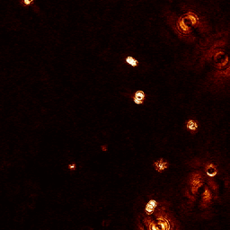
* `exp_orig_movie.mp4` and `exp_orig_movie.gif`
    * A video of the original captured frames. While this video is
      provided as reference, more processed products may be easier for diagnosis.
    * Example:\
      

## Metric/Plot Products

* `exp_timestats_duplicate_frames.png`
    * This is a binary plot that plots `TRUE` if a frame is identical to the
      previous one.
    * A **good** experiment will only plot `FALSE` throughout the sequence.
        * Example:\
          
    * A **bad** experiment will have a `TRUE` value somewhere in the sequence.
* `exp_timestats_intensity.csv` and `exp_timestats_intensity.png`
    * This plot reports the per-image intensity throughout the sequence.
    * A **good** experiment will have a consistent plot with no major spikes or
      variations. The value itself is less informative, but thresholds have been
      set based on previously processed experiments. These are shown as red, dashed
      lines.
        * Example:\
          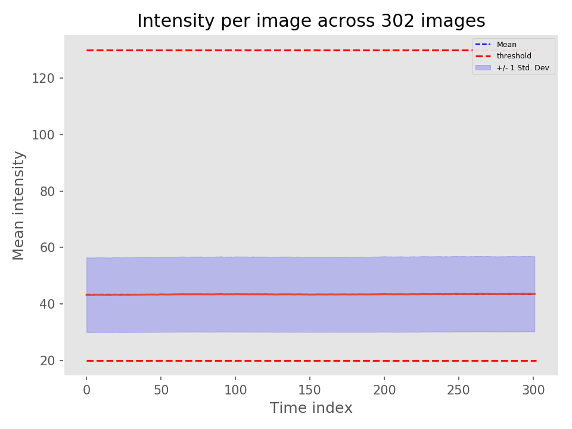
    * A **bad** experiment may exceed the thresholds. Even if it does not, it
      may still have visible spikes or large variations that still indicate that
      the experiment has data quality issues.
        * Example:\
          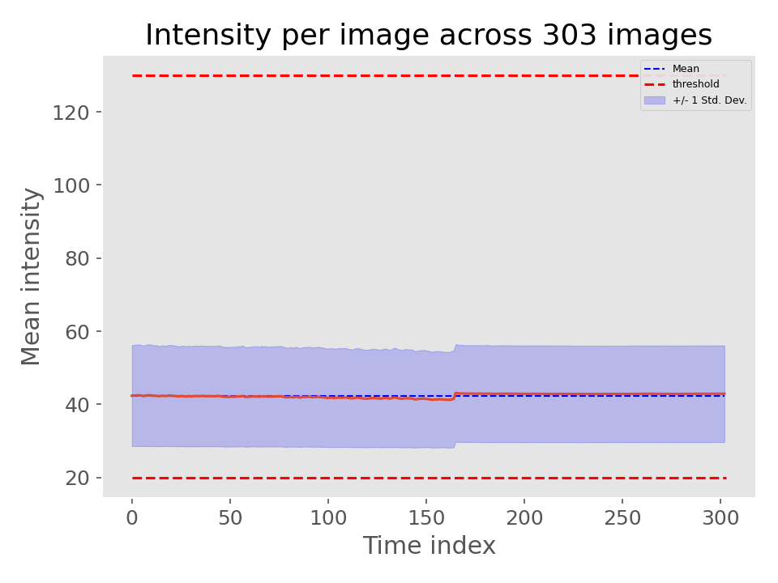
* `exp_timestats_pixeldiff.csv` and `exp_timestats_pixeldiff.png`
    * This plot reports the per-image intensity difference throughout the sequence.
    * A **good** experiment will have a plot that does not cross the set thresholds,
      shown as red, dashed lines. The thresholds were set based on previously
      processed experiments, and experiments that passed these thresholds were shown
      to have data quality issues. Some variance is expected.
        * Example:\
          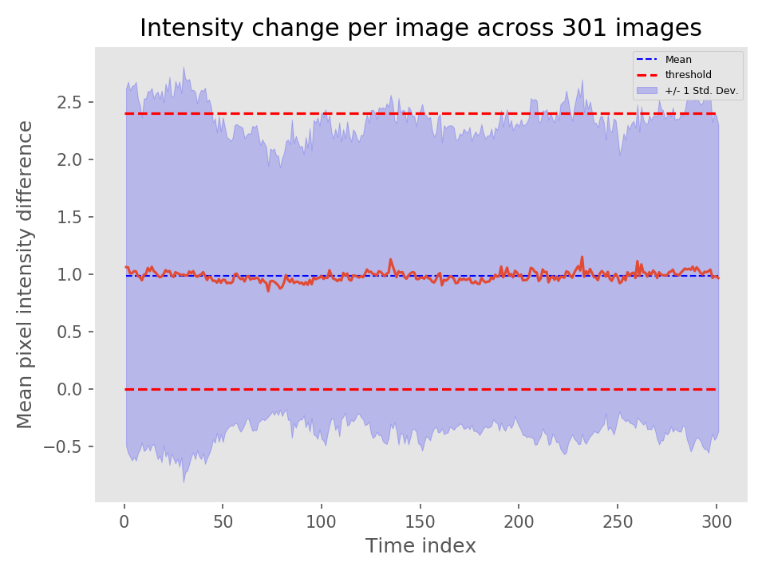
    * A **bad** experiment will have a plot that consistently exceeds the set
      thresholds or spikes past the thresholds. Consistently exceeding the thresholds
      may indicate that there are traveling waves, or that the subject of the experiment
      is too dense. Spiking past the thresholds may indicate a sudden change, such
      as a focal change or a shaken/moved stage.
        * Example:\
          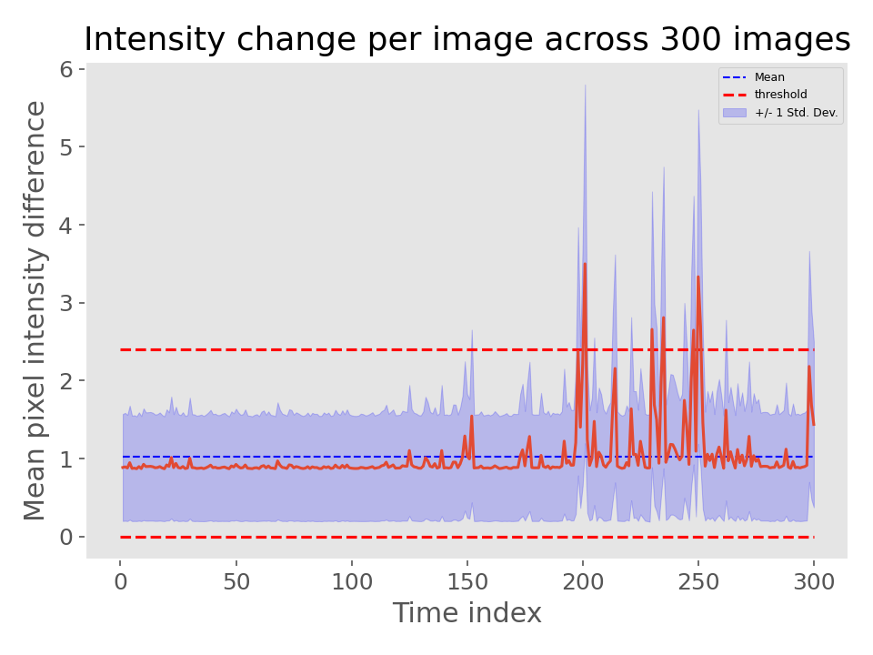
* `exp_timestats_density.csv` and `exp_timestats_density.png`
    * This plot reports an estimate of the per-image particle density throughout
      the sequence.
    * A **good** experiment will have a plot that does not cross the set thresholds,
      shown as red, dashed lines. The thresholds were set based on previously
      processed experiments. Some variance is expected.
        * Example:\
          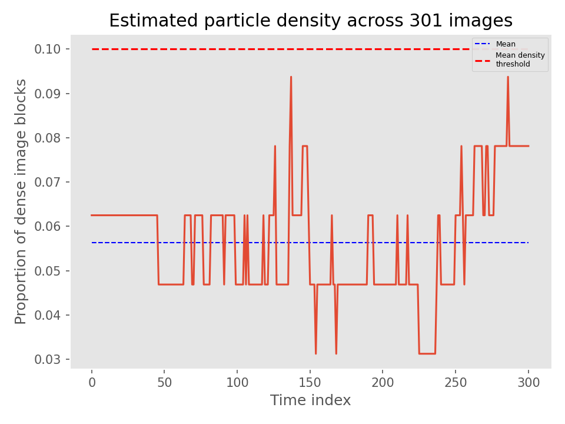
    * A **bad** experiment will have a plot that consistently exceeds the set
      threshold. Consistently exceeding the threshold usually indicates that many
      particles are present and are likely to overlap. This may cause the tracker
      performance to suffer.
        * Example:\
          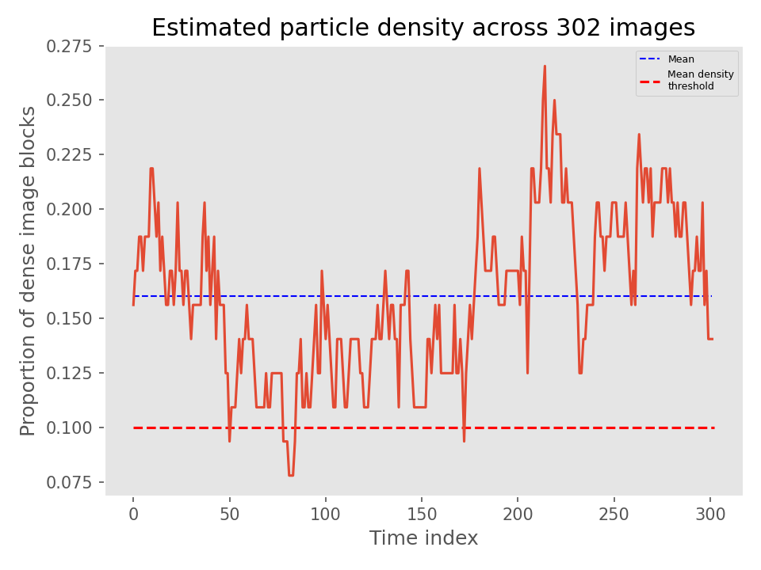
* `exp_processing_output.txt`
    * There are two values here that are especially useful as a sanity check:
    * `Loading errors` will indicate if there are any corrupt hologram images.
      Corrupt images in invalid .tif formats have been seen before.
      In addition to a frame count, a log will be printed indicating which images
      were corrupt:
      ```
      Bad image name:~/00207_holo.tif, index:6
      ```
    * `Repeated hologram images` will indicate if there are any hologram images
      that are identical to the previous frame. Such frames due to data collection
      issues have been seen before.
      In addition to a frame count, a log will be printed indicating which images
      were identical to the previous:
      ```
      Duplicate images name:207, index:~/00208_holo.tif
      ```
    * The per-image statistics are useful as a snapshot, but more detailed
      products exist to visualize these statistics.

## Notes
* `docs/presentations/Thresholds_Jake_07202020.pptx` contains more information
  on how the initial thresholds for intensity and differences were set (used in
  metric/plot products).

# Config Parameters #
* tracker_settings:
  * track_plot: bool
  * debug_video: bool
  * skip_frames: int
  * diff_comp:
     * median_window: int
     * absthresh: float
     * pcthresh: float
  * clustering:
     * dbscan:
       * epsilon_px: float
       * min_weight: float
     * filters:
        * min_px: int
  * tracking:
     * use_acceleration: bool
     * max_init_dist: float
     * max_assignment_dist: float
     * max_projected_frames: int
     * min_track_obs: int

# Output JSON Format #

* Times
  * Frame indices of the particles. Integers. No nulls.
* Particles_Position
  * Positions of the track particles. List of two-element lists of float coordinates. NaNs possible due to tracker re-acquisition.
* Particles_Size
  * Number of pixels discovered while clustering for each particle. List of integers. NaNs possible due to tracker re-acquisition.
* Particles_Bbox
  * Bounding box of pixels discovered while clustering for each particle. Lists of `[[topleft_y, topleft_x], [height, width]]`. NaNs possible due to tracker re-acquisition.
* Particles_Intensity
  * Sum of all pixel values discovered while clustering for each particle. List of floats. NaNs possible due to tracker re-acquisition. Useful for FAME/VFI, less so for HELM.
* Particles_Estimated_Position
  * Positions of the track particles; however, if particles were lost for a few frames due to reacquisition, nulls in Particles_Position are replaced with the projected location. Useful if you need non-null particle positions. List of list of float pairs.
* Particles_Estimated_Velocity
  * Velocities of the track particles, used during projection. List of list of float pairs.
* Particles_Estimated_Acceleration
  * Acceleration of the track particles, possibly used during projection. List of list of float pairs.
* Track_ID
  * ID of the track within the experiment. List of Integers.

# The Tracker Algorithm #

The tracker algorithm follows three main steps. At each frame:
1. Compute a processed/filtered diff image
2. Run clustering on the diff image
3. Assign clusters to current tracks/create new tracks

## Diff Image ##

### Compute rolling median ###

We first compute a median image over the past `median_window` frames. Median is computed independently per pixel using np.median(). A higher value is more robust to noise / particles passing through, a lower value is more adaptive (say, to a large out of focus particle moving slowly). This becomes less efficient both in memory and runtime as `median_window` increases. Perf could be improved by leveraging that the window only changes by one addition and one subtraction each frame. Thus the median can shift by at most one index in a sorted list.

### Subtract median image from current frame ###

The goal of the median image is to model the current background. By subtracting this image from the current frame we hope to highlight moving particles. The absolute value is taken to capture both bright and dark anomalies. Depending on particle speed and `median_window`, anywhere from just the leading edge, to particle body, to trailing edge can be captured. 

### Filter resulting diff ###

Even after median subtraction, the diff image is still noisy. To account for this noise and reduce complexity of the later clustering, we set both absolute and percentile thresholds on the diff. The absolute thresholding masks any diff pixels which fall below a raw pixel difference `absthresh`. The percent thresholding masks the smallest `pcthresh` percent of diff pixels. In this implementation, the percentile cutoff is precomputed and we then apply a single threshold using the max of the absolute and percentile thresholds.

Small note: The thresholds are used in tandem as they are robust to different variations in data. The absolute threshold accounts for varying point density. It aims to set a cutoff on the raw intensity difference between noise to noise and noise to particle. The percent threshold doesn't care about the magnitude of this raw difference; rather it is an apriori estimation on the density of particles as a percentage of pixels in the image.

### Percentile transformation ###

As a last step post filtering and before clustering, the diff image is normalized across the entire 0 to 255 8-bit range. All non-zero pixels are first sorted, then each pixel is assigned a value in the range 0-255 based linearly on its position in the sorted list. That is, the dimmest (non-zero) pixel in the diff is set to 0, the brightest is 255, and the median is floor(255/2). If multiple pixels tie in the sorted list, they are all set to the same value (the mean of their would-be assignments had there been no tie).

No tests have been done without this normalization by the new team. While it is expected this normalization helps ensure the same clustering parameters work for every frame, it is worth testing without normalization to verify that assumption.

## Clustering ##

We run weighted DBSCAN out of the box on the filtered, normalized diff image. DBSCAN takes parameters `epsilon_px` - the "epsilon" DBSCAN parameter in units of pixels, and `min_weight` - the minimum sum of point weights within an epsilon ball to start a cluster.

Post-clustering, we then filter out any cluster that has fewer than `min_px` points (unweighted).

Each cluster is then reduced to a single center - the unweighted mean of the points. One obvious alternative would be to use the centroid of the weighted points (unimplemented as of now).

Lastly, clustering (and later tracking) is only run after `skip_frames` frames have passed. This is to allow sufficient frames for the median computation before attempting later tracker stages.

## Assign Clusters to Tracks ##

After clustering, each cluster point (center) is assigned to a current or new track. At frame one, each cluster is considered its own track. At subsequent frames, all current tracks are projected to get an estimate on the current position of the tracked particle. 

This projection is either a simple (position + estimated velocity * elapsed time) or additionally includes acceleration depending on the value of `use_acceleration`. Estimated velocity is computed using most recent two frames. Acceleration uses three. At this time it seems that acceleration estimation is too noisy to aid in the projection.

Each detected cluster is assigned to the closest projected track, so long as this distance is less than `max_assignment_dist` in pixels. If the cluster is not within `max_assignment_dist` of any track, it starts a new track.

Multiple clusters may be assigned to the same track. In this case either the closest cluster is assigned to the track (and the others discarded; they do not form new tracks) or the unweighted mean of the assigned clusters is used. Which behavior is controlled by `allow_cluster_aggregation`.

If a track has no assigned clusters, then it is considered unmatched for that frame. A track can remain unmatched for up to `max_projected_frames` before termination. During this time the track continues to be projected using its last known estimates, and at any time may be picked up again by a new matched cluster. These unmatched frames are currently set to NULL in the track output, but could be interpolated in the future.

Note that the `max_assignment_dist` parameter needs to strike a careful balance between allowing *some* error to avoid fragmented tracks, whilst preventing interference from neighboring tracks and/or noise. Setting `allow_cluster_aggregation` to false should help with this problem -> only considering closest means tracks aren't affected by additional clusters at the outskirts of the range. Additionally if two particles get close, tracks are correct as long as each cluster remains closest to its projected track. Of course, severe overlap will result in two particles forming a single cluster. Here we hope that the track projection can regain tracking after the particles separate.

All finished tracks (either terminated after being unmatched for too many frames, or the last experiment frame is hit) are trimmed of any trailing NULL's. If tracks are too short (fewer than `min_track_obs` non-NULL frames), they are omitted. The tracker algorithm then outputs the surviving tracks.

# Features Extraction
The `features` step in HELM_pipeline calculates feature metrics that quantitatively characterize a particle's track. HELM will save out a CSV file (at `<experiment_directory>/features`) containing the value for each feature metric for all tracks after the `features` step completes. These features are used by the downstream machine learning algorithm (in the `predict` step) to classify if the tracked particle appears motile or not.

# Feature Descriptions
The full technical description and equations for each feature metric are in the [features jupyter notebook](feature_descriptions.ipynb).

## Pending Issues/Notes

- [ ] Gary's kernel projection features have not been implemented
- [ ] The classifier currently ignores any track labels other than `motile`
      and `non-motile`; most notably, tracks labeled `ambiguous` are dropped.
- [ ] The current classifier only uses a random forest model, need to discuss
      how other models and preprocessing should be implemented
- [ ] DOMINE integration

## Usage

### Pipeline

The pipeline only calls `train()` and `predict()`. They are called by the
`train` and `predict` steps, respectively, and rely on outputs from the 
following steps:

- Train:
  - Hand labeled tracks
  - `tracker` for detected tracks
  - `track_evaluation` for matching detected tracks to hand labeled tracks
  - `features` with `--train_feats` flag for extracting features only from
    tracks with matching hand labels
- Predict:
  - `tracker` for detected tracks
  - `features` for extracting features from all tracks
  - Hand labeled tracks of validation metrics are needed

The classifier has outputs in both the batch-level and experiment-level output
directories.

- Train:
  - Trained model: batch-level
  - Training metrics: batch-level
  - Cross validation metrics: batch-level
- Predict:
  - Classification output: experiment-level
  - Prediction metrics (if they exist): batch-level

### `train()`

```
def train(experiments, batch_outdir, config, hyperparams={"max_depth": 10}):
    """ Trains an sklearn random forest model on input features and saves it as a pickle

    Parameters
    ----------
    experiments: list
        List of experiments generated by pipeline-level glob
    batch_outdir: string
        Output directory for batch-level metrics and trained model
    config: dict
        Configuration dictionary read in by pipeline from YAML
    hyperparams: dict
        Hyperparameters for model training. Exposed for DOMINE optimization.
        NOTE: Temporarily defaults to {"max_depth": 10}
        NOTE: Do not add hyperparameters to config, it should not be configurable
    
    Returns
    -------
    None
    """
```

Notes:
* `hyperparams` is exposed but unused. This is intentional, as it should not
  be modified.
* Even if cross-validation is enabled, the model that is saved by this step is
  the model trained on the entire training set. In the future, we may want to
  save the best fold from cross-validation.
* Enabling calibration may not always result in a better-calibrated model,
  especially if there is limited training data. It is recommended to disable
  this option unless calibration is deemed necessary using the calibration curve
  plot.
* Features with `NaN` or `inf` values are converted using `np.nan_to_num()`
  before classification.
* Training will abort if:
  * There are no tracks in the `features` output
  * None of the tracks in the `features` output have valid labels
* Cross-validation will abort if there are not enough samples to do the number
  of folds specified. However, training itself will not abort.

### `predict()`

```
def predict(experiments, batch_outdir, model_path, config):
    """ Tests an sklearn model on input features and writes prediction JSONs

    Parameters
    ----------
    experiments: list
        List of experiments generated by pipeline-level glob
    batch_outdir: string
        Batch outdir specified in --batch_outdir
    model_path: string
        Absolute path to the model to be used for prediction
    config: dict
        Configuration dictionary read in by pipeline from YAML
    
    Returns
    -------
    None
    TODO: Return metrics for DOMINE optimization?
    """
```

Notes
* This function can use any sklearn model object. See the next section for the
  model definition.
* The classification output only includes the modified track JSON files with the
  additional keys `classification` and `probability_motility`.
* Metrics are written only for tracks in the input that have hand labels.

### Motility Classification Model Requirements

Any model, including those trained externally to OWLS/HELM, can be used as a motility classifier. However, it needs to meet the following specifications.

The provided model pickle file is expanded as follows:
```python
clf, feat_columns = pickle.load(f)
```

`clf` must be a trained sklearn classifier object with the `predict_proba()` call available. If preprocessing, such as normalization or standardization, is required, it must be included into this object using a [pipeline](https://scikit-learn.org/0.23/modules/compose.html#combining-estimators) object. Additionally, the classifier itself should be the last step in the pipeline, as the `classes_` attribute will be accessed on the last pipeline step. This attribute, which specifies the names of the predicted classes, must include `'motile'`. `sklearn` may warn if the trained classifier object and the software itself are running on different versions, so using the version specified in `requirements.txt` is strongly recommended.

`feat_columns` is a list of strings that includes the features used to train the classifier. This is compared against the features generated by the `features` step for consistency. This is done with a set comparison, so the list does not need to be in the same order, but the elements need to be the same. As long as the elements are the same, the ordering will be corrected to match the classifier.


# Interpreting Autonomous Science Data Products (ASDPs)

The ASDP step generates several products representing the "knowledge-compressed" version of the collected data. Knowledge compression attempts to distill the raw data in a manner that retains the scientific richness and complexity of the overall dataset but with a drastically reduced overall file size. This document describes how each HELM ASDP is generated and how they can be interpreted.

## Science Utility Estimate (SUE)
Filepath convention: `<exp_fname>/asdp/<exp_fname>_sue.csv`

The SUE represents an estimate of any particular experiment's scientific saliency; experiments with higher SUEs will be prioritized for downlink before those with low SUEs. A SUE consists of a CSV file containing a single number on the interval [0, 1]. JEWEL ingests these CSV files in order to generate a single downlink queue across all experiments.

The SUE is generated by calculated a weighted sum of metrics derived from a particular experiment. Currently, the HELM SUE is calculated using one metric: the number of particle tracks classified as `motile`. Each metric has an extrema value defined in the config such that the metric does not increase the SUE once it has passed this maximum value.

## Diversity Descriptor (DD)
Filepath convention: `<exp_fname>/asdp/<exp_fname>_dd.csv`

The DD is a vector that acts as a numeric fingerprint of the experiments content. A SUE consists of a CSV file containing a multiple metrics that each lie on the interval [0, 1]. If two experiments are very far away from each other in this hyperspace, they have large differences in their content. Along with the SUE, JEWEL ingests these CSV files in order to generate a single downlink queue across all experiments.

The DD is generated by concatenating several metrics derived from a particular experiment. Currently, the HELM DD is calculated using the number of particles classified as motile, non-motile, or other. Each dimension can be shrunk or expanded using the `weights` parameter. Like the SUE all metrics have an associated cap in the config so the metric is bounded.

## Mugshots
Directory convention: `<exp_fname>/asdp/mugshots/*.png`

Mugshots are small image crops around individual particles that were detected in the DHM data. These crops allow 3D reconstructions of the detected particles and are a light alternative (in terms of file size) to transmitting and reconstructing entire DHM images. Each track can have one or more mugshot images associated with it.

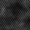

## Tracks
Directory convention `<exp_fname>/predict/*.json`

Tracks are json files that contain a number of details about detected particles. This includes, the particle's estimated position, velocity, acceleration, size, etc. over time. The track json files in `/predict` also contain classifier predictions as to the category of particle movement. Here, potential classes are `motile`, `non-motile`, or `other`. From these tracks, it's possible to generate visualization movies showing how particles moved throughout the course of the DHM recording.

## Visualization movie
Filepath convention: `<exp_fname>/asdp/<exp_fname>_visualizer.mp4`

The visualization movie shows the original data overlaid with autonomous information. The left pane displays the background subtracted data with detected tracks overlayed according to their classification (e.g., motile or non-motile). The right pane shows an animated version of the motion history image. Color indicates where in time the largest per-pixel change occurred and white pixels indicate the largest change was at this timepoint in the video. The top plot provides counts of motile/non-motile pixels over time (and the true number of motile/non-motile pixels if ground-truth labels are available.)

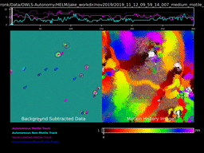