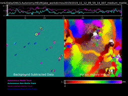

# Interpreting Autonomous Science Data Products (ASDPs)

The ASDP step generates several products representing the "knowledge-compressed" version of the collected data. Knowledge compression attempts to distill the raw data in a manner that retains the scientific richness and complexity of the overall dataset but with a drastically reduced overall file size. This document describes how each HELM ASDP is generated and how they can be interpreted.

## Science Utility Estimate (SUE)
Filepath convention: `<exp_fname>/asdp/<exp_fname>_sue.csv`

The SUE represents an estimate of any particular experiment's scientific saliency; experiments with higher SUEs will be prioritized for downlink before those with low SUEs. A SUE consists of a CSV file containing a single number on the interval [0, 1]. JEWEL ingests these CSV files in order to generate a single downlink queue across all experiments.

The SUE is generated by calculated a weighted sum of metrics derived from a particular experiment. Currently, the HELM SUE is calculated using one metric: the number of particle tracks classified as `motile`. Each metric has an extrema value defined in the config such that the metric does not increase the SUE once it has passed this maximum value.

## Diversity Descriptor (DD)
Filepath convention: `<exp_fname>/asdp/<exp_fname>_dd.csv`

The DD is a vector that acts as a numeric fingerprint of the experiments content. A SUE consists of a CSV file containing a multiple metrics that each lie on the interval [0, 1]. If two experiments are very far away from each other in this hyperspace, they have large differences in their content. Along with the SUE, JEWEL ingests these CSV files in order to generate a single downlink queue across all experiments.

The DD is generated by concatenating several metrics derived from a particular experiment. Currently, the HELM DD is calculated using the number of particles classified as motile, non-motile, or other. Each dimension can be shrunk or expanded using the `weights` parameter. Like the SUE all metrics have an associated cap in the config so the metric is bounded.

## Mugshots
Directory convention: `<exp_fname>/asdp/mugshots/*.png`

Mugshots are small image crops around individual particles that were detected in the DHM data. These crops allow 3D reconstructions of the detected particles and are a light alternative (in terms of file size) to transmitting and reconstructing entire DHM images. Each track can have one or more mugshot images associated with it.

## Tracks
Directory convention `<exp_fname>/predict/*.json`

Tracks are json files that contain a number of details about detected particles. This includes, the particle's estimated position, velocity, acceleration, size, etc. over time. The track json files in `/predict` also contain classifier predictions as to the category of particle movement. Here, potential classes are `motile`, `non-motile`, or `other`. From these tracks, it's possible to generate visualization movies showing how particles moved throughout the course of the DHM recording.

## Visualization movie
Filepath convention: `<exp_fname>/asdp/<exp_fname>_visualizer.mp4`

The visualization movie shows the original data overlaid with autonomous information. The left pane displays the background subtracted data with detected tracks overlayed according to their classification (e.g., motile or non-motile). The right pane shows an animated version of the motion history image. Color indicates where in time the largest per-pixel change occurred and white pixels indicate the largest change was at this timepoint in the video. The top plot provides counts of motile/non-motile pixels over time (and the true number of motile/non-motile pixels if ground-truth labels are available.)

