# Interpreting Validation

The validate step generates several products that can be used to assess the
quality of collected data. This document describes how each product was
generated and how they can be interpreted.

## Image/Video Products

Sorted by potential usefulness

* `exp_mhi.png` and `exp_mhi_labeled.png`
    * The color of each pixel represents the time at which that location
      experience the maximum difference between two time points. The opacity
      of each pixels represents the difference at that location relative to
      the rest of the image -- relatively large absolute changes will be
      vibrant while small changes will be mostly transparent.
    * From this image, it is possible to interpret where the trails are,
      how quickly the object was moving, and the pattern/behavior of the movement.
    * An experiment with **motile particles** will likely have clear, salient
      tracks in this image.
      Additionally, these tracks should have some velocity, indicated by a less
      color variation, which maps to a smaller time range in the colormap.
        * Example:\
          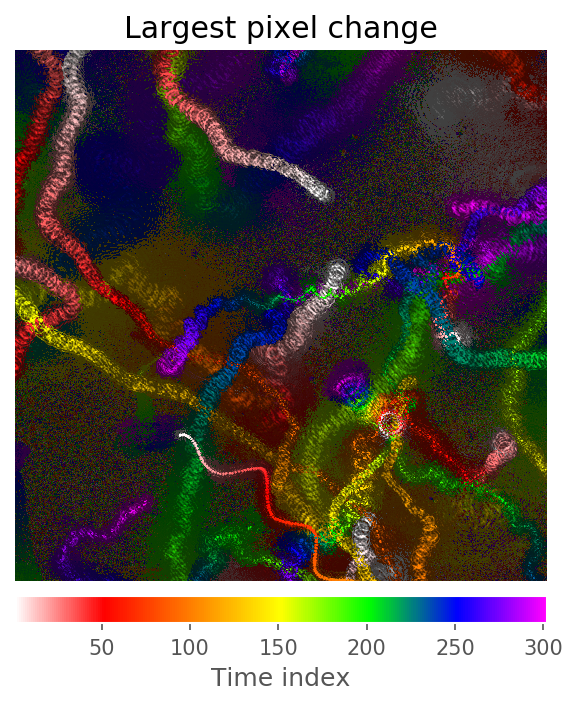
    * An experiment **without motile particles** may have no clear tracks.
      A "smear" pattern could also
      be present, which could be interpreted as the entire sample flowing in
      one direction, or the field of view changing during sampling.
        * Example:\
          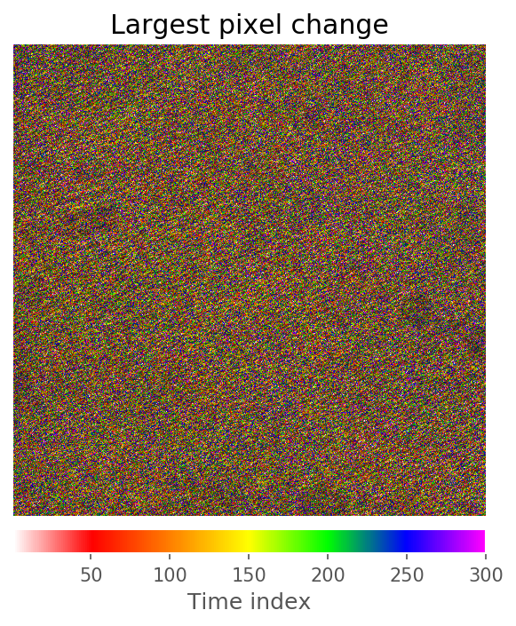
* `exp_k_powerspec_orig.png`
    * Fourier transform for confirming instrument configuration.
    * Example:\
      
* `exp_first_image.png`
    * The first hologram of the sequence. Any obvious issues,
      such as exposure or artifacts, can be quickly diagnosed.
    * Example:\
      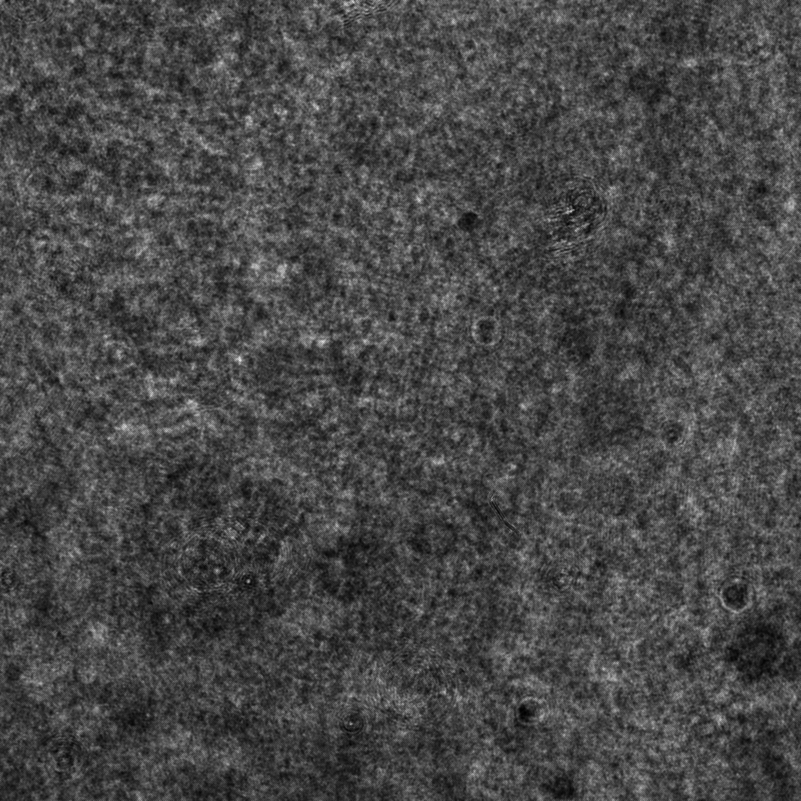
* `exp_median_image.tif`
    * The median image of the hologram of the sequence used to calculate
      baseline subtracted images.
      Useful for visualizing the background noise.
    * Example:\
      
* `exp_first_hist.png`
    * A pixel histogram of the first hologram of the sequence.
      Useful for checking under or over-exposure.
    * Example:\
      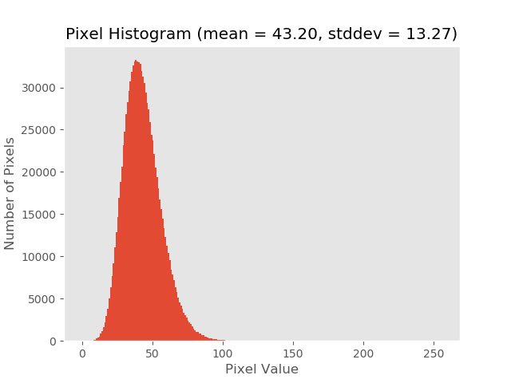
* `exp_density_first_image_stdevs.png`
    * An estimate of an experiment's particle density using standard deviation
      over image blocks. If the standard deviation in a particular block exceeds
      the threshold (set in config), then that block is considered dense.
      Useful for checking how dense/crowded an experiment is.
    * Example:\
      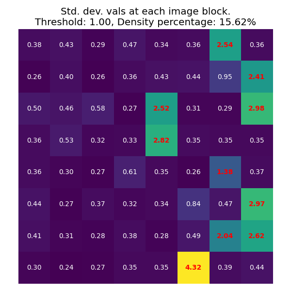
* `exp_density_first_image_viz.gif`
    * An animation showing which blocks of an experiment's first image are
      considered dense.
      Useful for checking how dense/crowded an experiment is and setting an
      appropriate density threshold in the config.
    * Example:\
      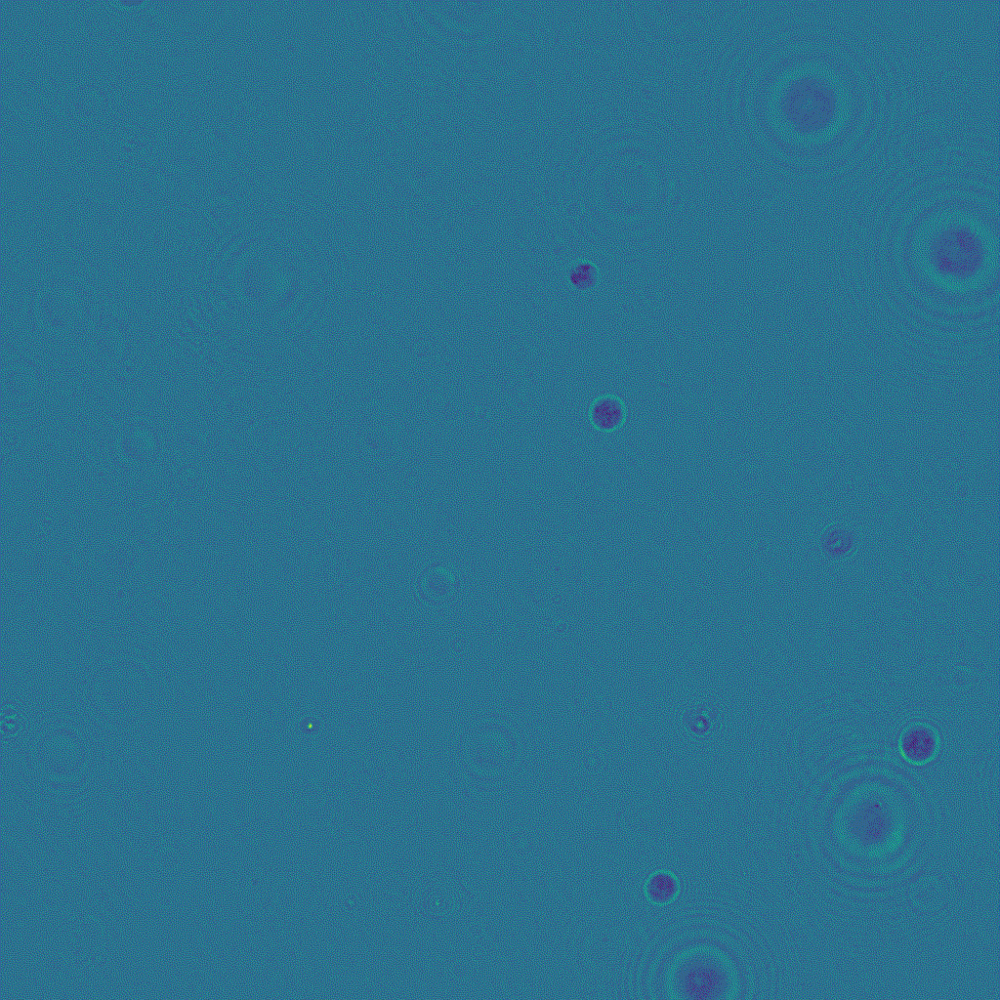
* `exp_base_movie.mp4` and `exp_base_movie.gif`
    * A video of the baseline-subtracted frames
      (currently, the baseline is computed as the median image
      across the dataset). This noise removal makes
      it much easier to identify and track moving targets.
    * Example:\
      
* `exp_diff_movie.mp4` and `exp_diff_movie.gif`
    * A video of the absolute difference between the current frame and the
      previous frame in the sequence. Any objects that have moved between the
      two frames are highlighted with a parentheses-like pattern `()` that
      results from the absolute difference of two offset circles.
    * Example:\
      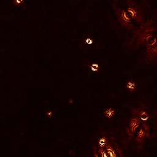
* `exp_trail_movie.mp4` and `exp_trail_movie.gif`
    * A "trail" video of the difference movie above. Each frame contains the
      maximum pixel value from the last 5 difference frames, including the current
      frame. This has the effect of generating a "trail" for each object, as each
      frame shows the object's current position as well as the last 4 positions.
      The length of the trail may change with configuration, but the default
      is currently 5.
    * This video may be easier to label than the other products, as the trail
      provides a point of comparison.
    * Example:\
      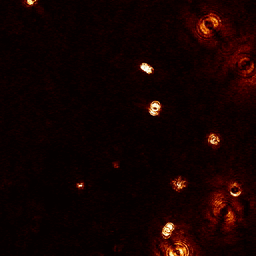
* `exp_orig_movie.mp4` and `exp_orig_movie.gif`
    * A video of the original captured frames. While this video is
      provided as reference, more processed products may be easier for diagnosis.
    * Example:\
      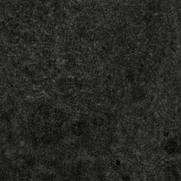

## Metric/Plot Products

* `exp_timestats_duplicate_frames.png`
    * This is a binary plot that plots `TRUE` if a frame is identical to the
      previous one.
    * A **good** experiment will only plot `FALSE` throughout the sequence.
        * Example:\
          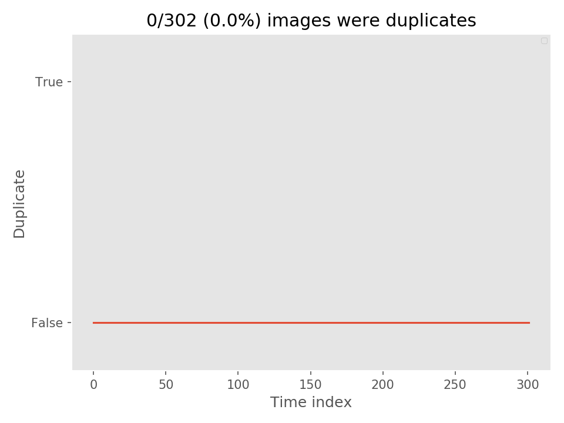
    * A **bad** experiment will have a `TRUE` value somewhere in the sequence.
* `exp_timestats_intensity.csv` and `exp_timestats_intensity.png`
    * This plot reports the per-image intensity throughout the sequence.
    * A **good** experiment will have a consistent plot with no major spikes or
      variations. The value itself is less informative, but thresholds have been
      set based on previously processed experiments. These are shown as red, dashed
      lines.
        * Example:\
          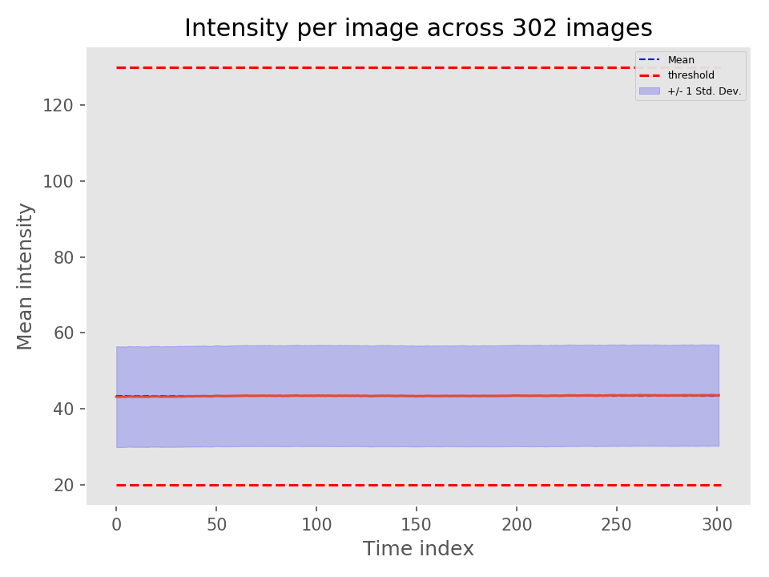
    * A **bad** experiment may exceed the thresholds. Even if it does not, it
      may still have visible spikes or large variations that still indicate that
      the experiment has data quality issues.
        * Example:\
          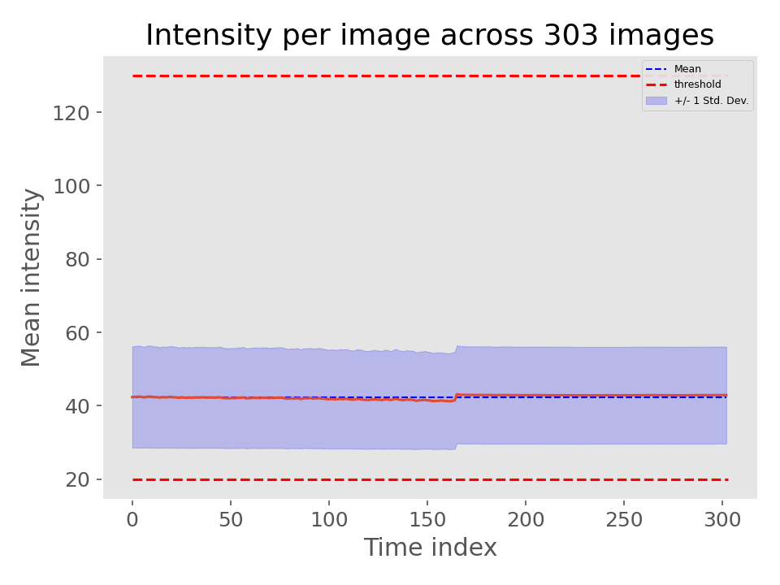
* `exp_timestats_pixeldiff.csv` and `exp_timestats_pixeldiff.png`
    * This plot reports the per-image intensity difference throughout the sequence.
    * A **good** experiment will have a plot that does not cross the set thresholds,
      shown as red, dashed lines. The thresholds were set based on previously
      processed experiments, and experiments that passed these thresholds were shown
      to have data quality issues. Some variance is expected.
        * Example:\
          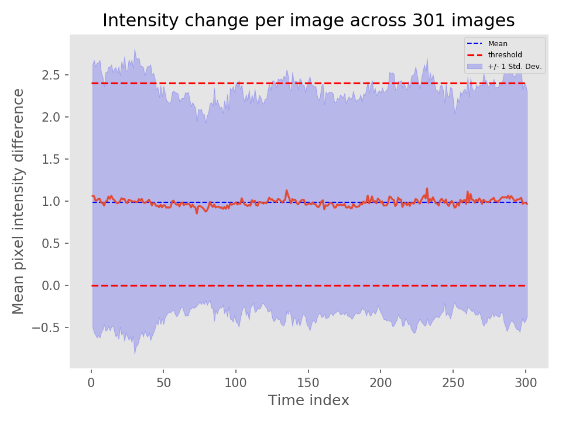
    * A **bad** experiment will have a plot that consistently exceeds the set
      thresholds or spikes past the thresholds. Consistently exceeding the thresholds
      may indicate that there are traveling waves, or that the subject of the experiment
      is too dense. Spiking past the thresholds may indicate a sudden change, such
      as a focal change or a shaken/moved stage.
        * Example:\
          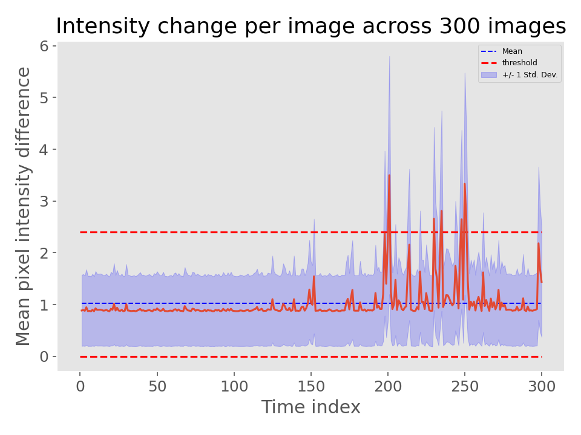
* `exp_timestats_density.csv` and `exp_timestats_density.png`
    * This plot reports an estimate of the per-image particle density throughout
      the sequence.
    * A **good** experiment will have a plot that does not cross the set thresholds,
      shown as red, dashed lines. The thresholds were set based on previously
      processed experiments. Some variance is expected.
        * Example:\
          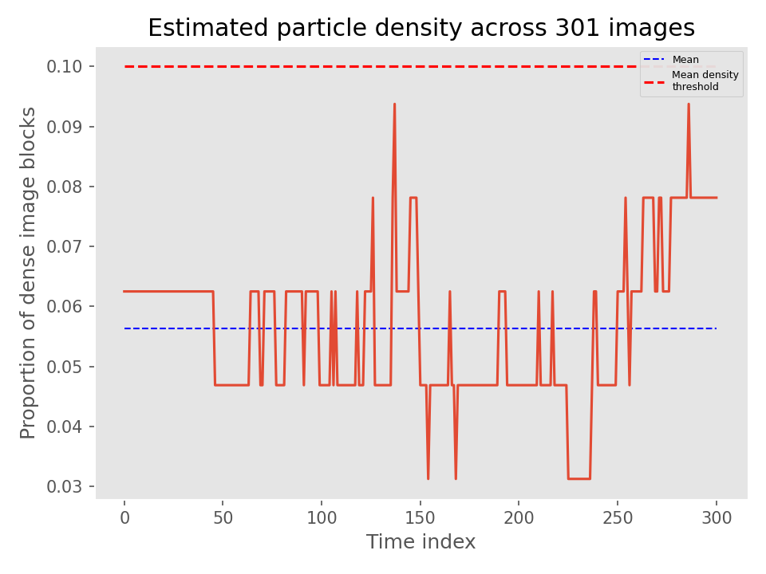
    * A **bad** experiment will have a plot that consistently exceeds the set
      threshold. Consistently exceeding the threshold usually indicates that many
      particles are present and are likely to overlap. This may cause the tracker
      performance to suffer.
        * Example:\
          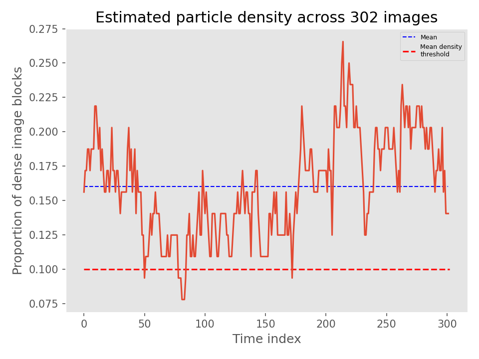
* `exp_processing_output.txt`
    * There are two values here that are especially useful as a sanity check:
    * `Loading errors` will indicate if there are any corrupt hologram images.
      Corrupt images in invalid .tif formats have been seen before.
      In addition to a frame count, a log will be printed indicating which images
      were corrupt:
      ```
      Bad image name:~/00207_holo.tif, index:6
      ```
    * `Repeated hologram images` will indicate if there are any hologram images
      that are identical to the previous frame. Such frames due to data collection
      issues have been seen before.
      In addition to a frame count, a log will be printed indicating which images
      were identical to the previous:
      ```
      Duplicate images name:207, index:~/00208_holo.tif
      ```
    * The per-image statistics are useful as a snapshot, but more detailed
      products exist to visualize these statistics.

## Notes
* `docs/presentations/Thresholds_Jake_07202020.pptx` contains more information
  on how the initial thresholds for intensity and differences were set (used in
  metric/plot products).
